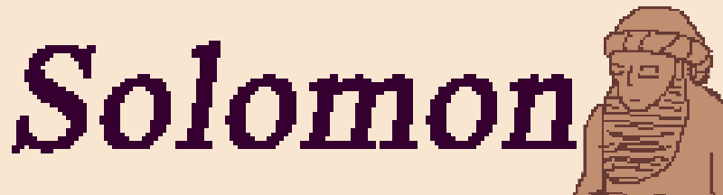

Solomon is the from scratch windowing system provided under the Mesopotamic project. The goals of this project is to rebuild the wheel to form a totally cross platform game engine. 

Solomon can be build as a static or dynamic library, and provides the `Solomon.h` header which provides the entry point `SolomonMain` into the cross platform executable.